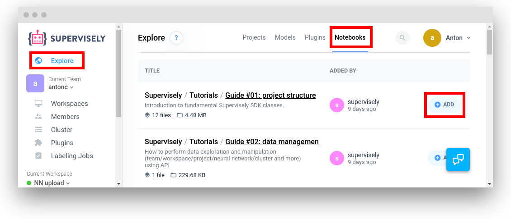
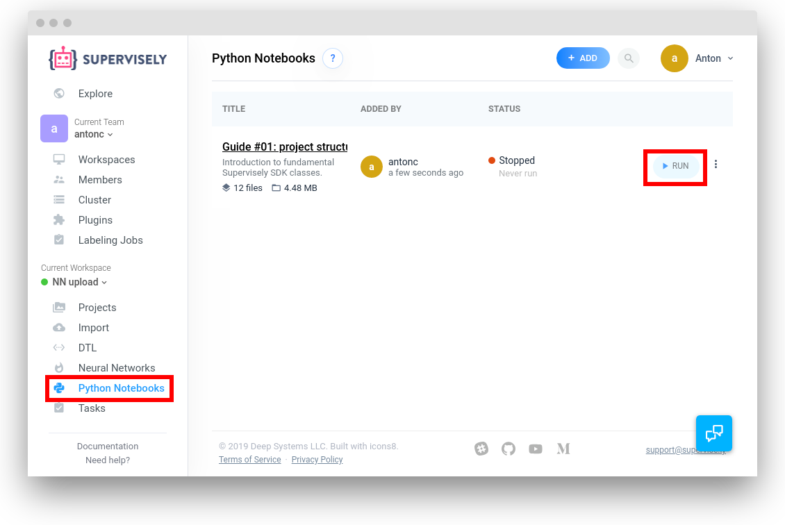
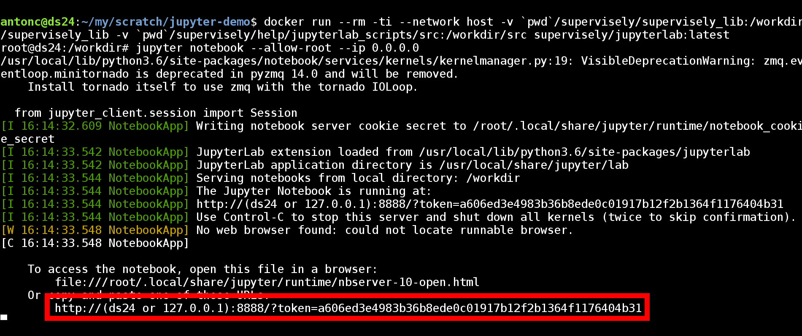
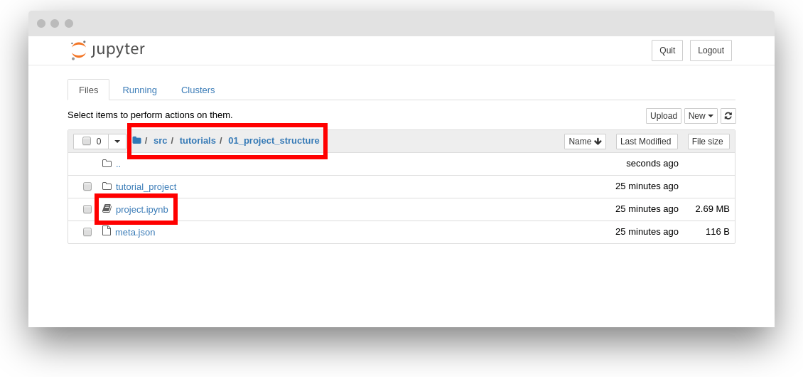

# Jupyter Notebooks

This plugin is used to run Jupyter Server in the cloud. 

We recommend to look at [tutorials](./src/tutorials) and
[cookbooks](./src/cookbook). This examples show how to use Supervisely SDK.

These Jupyter notebooks can be run both from within the Supervisely web
instance and offline on your machine.

### Running on the web instance

1. Go to `Explore` --> `Notebooks` section and clone the notebooks you need to
   your workspace:

   

2. Go to `Python Notebooks` section on the left and run the cloned notebook:

   
  
sdfw

### Running offline on your machine

You need to have Docker installed on your machine.

1. Clone our repository:

    ```
    git clone https://github.com/supervisely/supervisely.git
    ```

2. Start a docker image with all the pre-requisites and mount the necessary
   source directories from our repo:

   ```
   docker run \
       --rm -ti \
       --network host \
       -v `pwd`/supervisely/supervisely_lib:/workdir/supervisely_lib \
       -v `pwd`/supervisely/help/jupyterlab_scripts/src:/workdir/src \
       supervisely/jupyterlab:latest
   ```

3. Start up a Jupyter server within the running docker image:

  ```
  jupyter notebook --allow-root --ip 0.0.0.0
  ```

4. Open the displayed URL in the browser (use 127.0.0.1 as a host):

    

5. Navigate to the notebook you need and launch it:

    