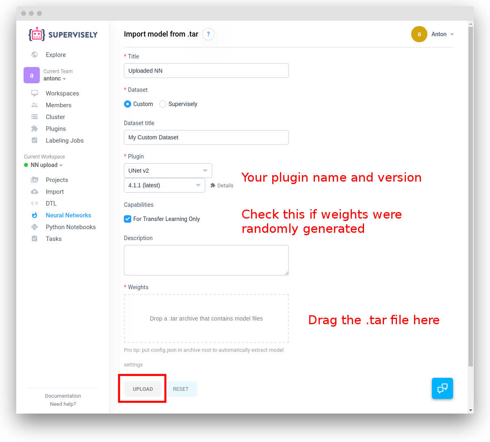

# Integrating a custom neural network with Supervisely

This guide describes the relatively low-level details of implementing a neural
network plugin for Supervisely. Neural networks are somewhat more complex than
the other [Supervisely plugins](../01_create_new_plugin/how_to_create_plugin.md): in addition to code
(packed as usual into a
Docker image), neural networks also need model weights (to run inference or
serve as a starting point for training a new model) and an output config (this
determines which semantic classes are predicted using a given set of weights).

So on a high level, here is what you need to do to integrate your custom neural
network into Supervisely:
1. Write the code to implement the model logic. The code has to conform to a
   [specific layout](#code-layout) for the system to recognize your neural
   network properly.
2. Package the code into a Docker image and push to a Docker repository as
   you would do with any other type of plugin. See our tutorial on [adding a
   generic plugin to Supervisely](../01_create_new_plugin/how_to_create_plugin.md) for details.
3. [Create and upload a set of weights](#create-and-upload-model-weights) along
   with a model config to the Supervisely web instance

As with other types of Supervisely plugins, Neural network plugins are Docker
images, executed by the Supervisely agent.
When the agent receives a request for training or inference from the web
instance, it downloads the necessary data, sets up the required directories and
runs the neural net docker image with data and results directories mounted to
specific locations. As the NN docker container runs, the agent parses the logs,
streams training metrics and progress reports back to the web instance.
Finally, the agent uploads the end results
(again, taken from specific directories) to the web instance.

This guide is relies on the 
[generic plugin integration guide](../01_create_new_plugin/how_to_create_plugin.md)
for understanding the basic concepts. We will focus on the following aspects:
* Expected source code layout for the build system to recognize all components
  of the plugin properly.
* Layout of the input and output data compatible with the agent.
* Reporting metrics to the Supervisely web instance during training.
* Creating and uploading the initial set of weights (neural net state) to the
  Supervisely web instance.
* Using Supervisely SDK
  [base classes for training and inference](#supervisely-sdk-base-classes-for-training-and-inference)
  to avoid reimplementing mundane functionality like working with configs and
  focus only on the core of your custom logic.

## Code layout

There are two major modes for a neural network plugin: training and batch
inference. There is also an online inference deployment mode, but for now we
will skip it. Each mode corresponds to a separate entry point in the docker
image, which must be a Python script.

The minimal overall required code layout is as follows:
```
/
|-- my-custom-nn/      # Directory name does not matter much.
|   |-- src/           # Must be src
|   |   |-- train.py      # Training entry point
|   |   |-- inference.py  # Inference entry point
|   |-- plugin_info.json  # Basic metadata - title, description etc.
|   |-- predefined_run_configs.json  # Default run connfigs to show in web instance
|   |-- Dockerfile
|   |-- VERSION        # Docker image naming for the build system.
|-- supervisely_lib/   # Supervisely SDK so that it is available for Docker build.
```

Check out the [generic plugin guide](../01_create_new_plugin/how_to_create_plugin.md)
for details on `Dockerfile`, `plugin_info.json` and `VERSION` files and how to
pack these code directories into a Docker image.

The `predefined_run_configs.json` contains default configs that will be exposed
in the web UI. It must be a list of JSON dictionaries of the following format:
```
[
  {
    "title": "Default Train Config",  # Config title to be exposed in the UI
    "type": "train",                  # Task type for which the config applies.
    "config": {                       # Model-specific task config.
      "epochs": 3,
      "lr": 0.001
      # Other required training settings go here
    }
  },
  {
    "title": "High Learning Rate Training Config",
    # Multiple pre-defined configs for the same task type are possible
    "type": "train",
    "config": {
      "epochs": 3,
      "lr": 0.1
    }
  },
  {
    "title": "Default Inference Config",
    "type": "inference",
    "config": {
      "some_threshold": 0.1
    }
  },
]
```
To start with, it is safe to leave `predefined_run_configs.json` with an empty
list: `[]`.

## Training mode

In this mode `train.py` is used as an entry point.

### Training mode directories layout

The agent downloads the training data and initial model weights and config and
mounts them for the neural net plugin as follows:
```
/-- sly_task_data/
    |-- data/
    |   |-- training-project-name/
    |-- model/
    |   |-- config.json
    |   |-- model_specific_initial_weights
    |-- results/
    |-- task_config.json
```
Let us go over the directories in more detail:
* `data` contains the training data as a
  [Supervisely project](https://docs.supervise.ly/import/local_files/supervisely/).
  We strongly suggest using our Python SDK (starting from
  `supervisely_lib.project.project` module)to read, parse and transform the
  data instead ofworking with raw JSON files.

  For now, training only runs with one input project, but support for multiple
  projects may be added in the future.

* `model` directory contains two components:
  * `model_specific_initial_weights` us a checkpoint, in whatever format your model
    supports, with pretrained weights that are used to initialize the model for
    training. The name can be anything, this is all determined by your plugin
    code. For example, for PyTorch models we usually use `model.pt` as a weights
    checkpoint file, while for TensorFlow we usually use a 'model_weights'
    directory with several files comprising a TensorFlow checkpoint.

    It is possible, but rather not typical, to not have this file/directory.
    If your model supports weights initialization completely from scratch, see
    later in this guide how to set up training without this file.

  * `config.json` describes the model configuration corresponing to the initial
    weights checkpoint above. It is a json dict with 3 sections like this:
    ```
    {
      "settings": {
        # Model-specific settings, e.g. num_convolution_layers, enable_batchnorm etc
      },
      "out_classes": [
        # A list of output Supervisely object classes for the checkpointted model.
        {"title": "bg", "shape": "bitmap", "color": "#BAFA92"},
        {"title": "kiwi", "shape": "bitmap", "color": "#FF0000"},
        {"title": "lemon", "shape": "bitmap", "color": "#51C6AA"}
      ],
      "class_title_to_idx": {
        # Correspondence between the Supervisely classes above and the integer class
        # IDs of the model.
        # This is used when continuing training from an existing checkpoint for the
        # same set of classes to make sure the newly built class apping is
        # consistent with the checkpoint.
        "bg": 0,
        "kiwi": 1,
        "lemon": 2
      }
    }
    ```

  * `results` is the directory to which the intermediate training checkpoints and
    final results should be written by the code in `train.py`.

  * `task_config.json` is a JSON config, filled in by the user in the web UI
    before kicking off the training. Although in principle the structure here
    may be arbitrary, depending on how you decide to handle configuration, we
    have worked out a common structure for our own plugins and suggest keeping
    to that structure. In particular, this will make it possible to rely on the
    training helpers in the SDK (`supervisely_lib.nn.hosted.trainer`)
    ```
    {
      "lr": 0.001,  # Add other model and optimizer settings here.

      "epochs": 3,  # The number of passes over the whole training data.

      # How frequently to validate on the validation fold. 0.5 means every half
      # an epoch.
      "val_every": 0.5,

      # Batch sizes to use for training and validation.
      "batch_size": {
        "val": 3,
        "train": 3
      },

      # We use tags to split the input project into train and validation folds.
      # Here the values of the map are the tag names to use for the two folds.
      # All the images where a given tag is present will be assigned to its
      # respective fold.
      "dataset_tags": {
        "val": "val",
        "train": "train"
      },

      # Here wew are using two possible values:
      # - "continue_training": continue training on a dataset fully compatible
      #   with the predicted classes of the initial checkpoint.
      # - "transfer_learning": reset the head (last layer(s) of the model) to
      #   match the classes of the training dataset. This may involve changing
      #   the dimensions of the head to match the new number of predicted
      #   classes and should always involve resetting head  randomly.
      "weights_init_type": "transfer_learning"  # or "continue_training"
    }
    ```

### Training process

During training, we need to initialize the model using the starting checkpoint
in `/sly_task_data/model`, then train the model using custom model-specific (and
deep learning framework specific) logic.

The only interface with the agent and
rest of Supervisely system we need to maintain is saving the checkpoints in
expected (by the agent) locations and logging in the proper format to stream the
training metrics back to the web UI.

#### Saving the checkpoints and uploading to the Supervisely instance

To save a checkpoint:
* Make a new directory in `/sly_task_data/results`.
* Write to that new directory the model weights and `config.json` as explained
  above in `model` section of
  [train directories layout](#training-mode-directories-layout).
* Tell the agent that a new checkpoint has been saved. This is typically done by
  calling
  ```
  supervisely_lib.task.progress.report_checkpoint_saved(
    checkpoint_idx,  # Checkpoint index in order.
    subdir,          # Directory with the checkpoint.
    sizeb,           # Total checkpoint size in bytes.
    best_now,        # Is this the best performing checkpoint so far?
    optional_data    # This can be None
  )
  ```

  Alternatively, one can simply log a one-line JSON message to STDOUT:
  ```
  {"message": "checkpoint", "event_type": "EventType.CHECKPOINT", "id": 3, "subdir": "/sly_task_data/results/000003", "sizeb": 1248, "best_now": true, "optional": null, "timestamp": "2019-03-26T11:38:08.018Z", "level": "info"}
  ```
  The logged message is parsed by the agent, and if the format is
  recognized, trigger checkpoint uploading to the web instance.


#### Streaming training metrics for the web UI

Streaming metrics is usually done by calling
`supervisely_lib.report_metrics_training()` or
`supervisely_lib.report_metrics_validation()`:
```
supervisely_lib.report_metrics_validation(0.7, {'accuracy': 0.35})
```
Alternatively, one can manually log a specially formatted single-line message
string to STDOUT:
```
{"level": "info", "message": "metrics", "event_type": "EventType.METRICS", "type": "val", "epoch": 0.7, "metrics": {"accuracy": 0.35}, "timestamp": "2019-03-26T11:14:04.577Z"}
```

The logged message is parsed by the agent, and if special metrics format is
recognized, it is passed on the web UI for display in the training chart.

## Inference mode

In the inference mode, `inference.py` is an entry point.

Similar to the training mode, the overall process is to instantiate and load the
weights for the neural network model using a checkpoint in
`/sly_task_data/model`, read the input images from a project in
`/sly_task_data/data` and write the resulting project with inference results in
Supervisely format to `/sly_task_data/results`.

### Inference mode directories layout

Input directories layout is the same as in
[training mode](#training-mode-directories-layout).
The only difference is that the `/sly_task_data/results` directory should
receive not model checkpoints, but a data project in Supervisely format with the
labels or tags added according to the inference results.

## Create and upload model weights

Neural networks need a set of weights both for inference and as a starting point
for training. It also needs to map the predictions of the model (which
are typically indices into a tensor) to the semantic named classes.

In Supervisely, this combination of weights and configuration is stored as a
`.tar` file of the following format:
```
model-state.tar
| -- config.json
| -- model-specific-weights-file  # e.g. model.pt fo PyTorch
```

To finish intergrating your model into Supervisely, you will need to create such
a `.tar` file and upload it to the web instance.

### Creating a model state file

#### Model weights

Within the model state `.tar` file, the model-specific weights file can be named
arbitrarily and have arbitrary format, as long as your `train.py` and 
`inference.py` use the same naming and format to read and write the weights.

If you already have a set of weights pre-trained on some dataset, you can use
those, just don't forget to make a corresponding
[classes config file](#output-classes-config) with output classes and class
integer indices consistent with the pre-trained weights.

If you don't have a reasonable set of weights already, you can simply create and
upload a random set of weights so that your training runs have a starting point.

For example, in PyTorch, assuming your model inherits from the standard
`torch.nn.Module` class and has a constructor with `num_out_classes` argument
to set the required number of output classes, you can get a random set 
weights with 2 classes simply as
```
import torch

random_model = MyCustomModel(num_out_classes=2)
torch.save(random_model.state_dict(), './model.pt')
```

#### Output classes config

This should be a `config.json` file of the same format as outlined in the
[training section](#training-mode-directories-layout). 

### Pack and upload the model state

#### Packaging a .tar file

The model weighs and config must be packed into an uncompressed `.tar` file so
that the config and weights are in the `top level directory` within that `.tar`
file, *not* within a subdirectory. For example, if you have the files prepared
in a directory
```
my-custom-model-state/
| -- config.json
| -- model.pt
```
then you can create the required tar file with
```
tar -cf my-custom-model-state.tar -C ./my-custom-model-state .
```
and get the the following structure:
```
my-custom-model-state/
| -- config.json
| -- model.pt
my-custom-model-state.tar
```

#### Uploading to the web instance

Before uploading the `.tar` file, make sure you have first added your custom
plugin as outlined in the [plugin integration guide](..//01_create_new_plugin/).

Then, go to the `Neural Networks` section in the left menu and select
`UPLOAD .TAR` button on top:


On the upload page, fill in the details and drag your `.tar` file to the
`"Weights"` area. If you have generated model weights randomly, don't forget to
check the `"For Transfer Learning Only"` box to make sure you don't accidentally
use your randomly initialized model for inference later:



That's it. Now you will see the freshly uploaded neural network under
`Neural Networks` menu, and run training and inference with it.

## Supervisely SDK base classes for training and inference

While the implementations of different neural net *architectures* may be quite
different, down to different deep learning frameworks being used, the logic of
*interfacing with Supervisely* datasets and configs has a lot in common. We have
factored out those common bits to the SDK to provide base classes for both
training and inference mode. With those base classes as foundation, one can rely
on the SDK to handle mundane tasks like mapping between label classes and
integer IDs and focus only on implementing the core neural net architecture.

### Inference mode helpers

Inference mode support in the SDK involves three primary components:
* `SingleImageInferenceBase` class in
  `supervisely_lib.nn.hosted.inference_single_image`. This is the class one
  would extend to implement inference for a specific neural network
  architecture. This class exposes an `inference(image, ann)` method, which
  other components rely on.
* `BatchInferenceApplier` from `supervisely_lib.nn.hosted.inference_batch`
  handles the IO tasks for batch inference. Once the single-image inference
  logic is implemented by extending `SingleImageInferenceBase`, one can pass the
  resulting object to the batch applier, and it will handle iterating over the
  input dataset, reporting progress to the web UI and saving the results.
* Different inference aggregation mode support. Sometimes, instead of feeding
  the whole input image to the neural net, one wants to apply a different logic,
  e.g. only feeding a specific part of the image, or running a sliding window
  across the image and aggregate the results. In Supervisely SDK we have
  factored out several such approaches into *inference modes*, which are
  available in `supervisely_lib.nn.hosted.inference_modes`. The most frequently
  used mode, `InfModeFullImage` simply runs inference on the whole input image.

To leverage Supervisely SDK for inference:
* Extend `SingleImageInferenceBase` to plug in your specific neural net
  architecture. Implement the following methods:
  * `_construct_and_fill_model()`, which is called once and must initialize the
    model and load the weights. You can rely on the model config already being
    parsed and available as `self.train_config`. Also the
    `integer id --> supervisely_lib.ObjClass` mapping is available as
    `self.out_class_mapping`.
  * `inference(img, ann)` - single image inference, takes an image (as numpy
    array) and its annotation (as `supervisely_lib.Annotation` and returns a new
    `Annotation` with just the results of the inference (i.e. without copying
    the input annotation data). Rely on `self.out_class_mapping` to map from
    integer class IDs from the network to Supervisely label classes.

Once you have properly extended `SingleImageInferenceBase`, the rest of the
inference script can be written simply as

```
class CustomInference(SingleImageInferenceBase):
    # Model-specific logic here.

def main():
    custom_inference = CustomInference()
    # By default simply use the full image as model input. Other inference modes
    # are possible, see supervisely_lib/nn/hosted/inference_modes.py
    default_inference_mode_config = InfModeFullImage.make_default_config(
        model_result_suffix='_custom')
    dataset_applier = BatchInferenceApplier(
        single_image_inference=custom_inference,
        default_inference_mode_config=default_inference_mode_config)
    # Process the input images and write out results.
    dataset_applier.run_inference()


if __name__ == '__main__':
    sly.main_wrapper('CUSTOM_INFERENCE', main)

```

 and the inference config structure takes the following shape:
 ```
"model": {
    # This is the only part of the config visible by the custom model.
    # All the model-specific settings shiuld go here.
    "custom_threshold": 0.3
},
"mode": {
  # This part refers to inference aggregation mode.
  # It has no bearing on the individual inference calls and not visible to the
  # custom model.
  # See supervisely_lib/nn/hosted/inference_modes.py for details and other
  # aggregation modes.
  "name": "full_image",  # By default feed the whole image to the model.
  "model_classes": {
    "save_classes": "__all__",  # Save all the output classes.
    "add_suffix": "_custom"   # Append _custom suffix to the output class names.
  }
}
```

### Training mode helpers

Neural networks training involves comparatively more variety than inference,
since different frameworks have different approaches to the control flow during
training. Hence our basic training class, `SuperviselyModelTrainer` from
`supervisely_lib.nn.hosted.trainer` covers only the basic tasks of config and
class integer ID management and weights checkpoining.

The following methods of the base class need to be implemented:
* `get_default_config()` (static). This should provide the defaults for all the
  required training config parameters. This way the web UI user only needs to
  specify the values that are different from defaults, which simplifies the
  workflow.
* `get_start_class_id()`. Just return 0 here if you don't have any special or
  implicitly defined classes (see below).
* `_determine_model_classes()`. This should fill in the set of output classes
  for the model given the input dataset. The reason implentation is not
  straightforward here is that sometimes there are classes that have to be
  treated in a special way, like a *neutral* class, that should never be
  predicted by the model, but can be present in the dataset and treated
  specially in the optimization loss computations. Also some
  segmentation neural net implementations treat *background* class specially,
  always assignining it index 0 and treaing all pixels that do not have class
  assigned explicitly as background.

  Here you usually want to call a base class method, either
  `_determine_model_classes_detection()` (if you have no special classes) or
  `_determine_model_classes_segmentation()` if you do have special classes.

* `_construct_and_fill_model()`.This should initialize the model and load the
  weights from a checkpoint in `/sly_task_data/model`. Here the task config is
  available as `self.config` and the class title to integer index mapping as
  `self.class_title_to_idx`.

* `_construct_loss()` is typically useful for TensorFlow models, where one
  needs to create loss computational graph components explicitly.

* `_construct_data_loaders()` - this is where dataset loading, train/val
  split and splitting the input into batches and feeding to the model is set
  up. This logic is quite framework specific. Our toy example uses PyTorch.

* `_dump_model_weights(out_dir)` - save the model weights into a given
  directory. This helper is used for checkpointing. This mehod is wrapped by
  `_save_model_snapshot()`, where all the communication with the agent
  necessary for checkpointing is factored out.

* `_validation()` - should compute metrics for the current model on the
  validation data and return metric name to value dict.

* Finally, `train()` must tie everything together and implement gradient
  descent steps, keep track of the training epochs, and call `_validate()` and
  `self._save_model_snapshot()` as appropriate.

Once the `train()` method is implemented, the rest of the `train.py` script
becomes simply
```
def main():
    x = CustomTrainer()
    x.train()


if __name__ == '__main__':
    sly.main_wrapper('CUSTOM_TRAIN', main)
```

One can see that strictly speaking only implementing the `train()` method,
in however is the most convenient way is nesessary. Nevertheless, we have
found that splitting up the stages of training setup in the predefined
methods above helps maintain the structure of the code more easily and
encourages commonality between different neural network implementations.
