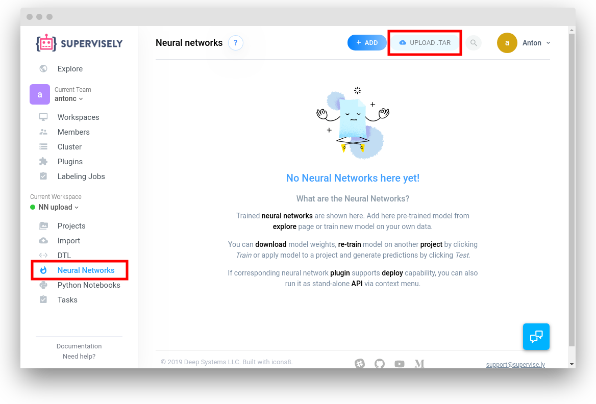

# Simplified integration a custom Pytorch segmentation model with Supervisely

This tutorial describes the steps necessary to integrate a custom segmentation
neural network implemented in Pytorch with Supervisely. Here, we assume that you
have developed a neural network with Pytorch and wish to use your
implementation in the context of Supervisely.

We aim this tutorial to be the minimum effort step by step guide, without
going into detail of all the affected components. If you need to integrate
a different kind of neural network (something other than segmentation),
need to use a different deep learning framework, or want to learn the details
of how neural network plugins are organized, see our
[general neural network integration tutorial](../03_custom_neural_net_plugin/custom_nn_plugin.md).

Integrating your custom model will require these steps:
1. Adapt your implementation to match the interfaces of [our template](easy_segmentation_example/src/model.py).
2. Pack the resulting code into a Docker image and publish to a public repository.
3. Tell Supervisely web instance about your new Docker image.
4. Create and upload an initial set of weights for your model.

Let us now describe the steps in detail.

## Adapt your implementation to our template

1. Make a copy of the [easy_segmentation_example](easy_segmentation_example)
template directory.

2. If your implementation has any special dependencies, add them to the template
  [Dockerfile](easy_segmentation_example/Dockerfile).

3. Add all your source files to the [src](easy_segmentation_example/src)
  directory.

4. In [model.py](easy_segmentation_example/src/model.py) change
  `model_factory_fn()` to return an instance of your model. **Important**: the
   model must inherit from the `torch.nn.Module` class.

5. **Important**. In your model implementation, make all the layers whose
   dimensionality depends on the number of predicted classes have names of form
   `_head_layer_SOMETHING`. This is necessary to support user-specified number
   of classes for transfer learning. In transfer learning mode the head layers
   weights will not be loaded from a base snapshot, but initialized randomly.

6. In [model.py](easy_segmentation_example/src/train.py) change the
   `optimization_loss_fn` argument if you need a different loss.

    6.1 Optional. If you want to be able during training to keep track of more
    metrics besides the optimization loss in the web instance UI, pass a `dict`
    with the metric functors to the `PytorchSegmentationTrainer` constructor, e.g.
    ```
        trainer = PytorchSegmentationTrainer(
            model_factory_fn=model_factory_fn,
            optimization_loss_fn=torch.nn.modules.loss.CrossEntropyLoss(),
            training_metrics_dict={
                'accuracy': supervisely_lib.nn.pytorch.metrics.MultiClassAccuracy()}
    )
    ```

7. In [VERSION](easy_segmentation_example/VERSION) file, fill in the name and
   version you want to give to your new docker image.

## Build and publish the plugin Docker image

To make your plugin available to the Supervisely web instance, you need to
publish the plugin to a public Docker repository. If you do not have your own
repository set up, the free [Docker Hub](https://docs.docker.com/docker-hub/) is a good default option.

Once you figure out your Docker repository setup, build the plugin docker image by executing the [`build_plugin.sh`](../01_create_new_plugin/build_plugin.sh) script:

```sh
./build_plugin.sh your.docker.registry path/to/your_plugin_root_dir
```

The script will print out build status information, ending with the full name of the plugin Docker image. If the build was successful, publish your image to the public repository. If the `VERSION` file contains `nn-pytorch-simple-segmentation-example:4.3.1` as in our example, the command would be:
```sh
docker push your.docker.registry/nn-pytorch-simple-segmentation-example:4.3.1
```

## Tell Supervisely web instance about your new Docker image

Go to "Plugins" page and press "Add" button:


Enter plugin title and docker image and press "Create" button:


As a result new plugin will appear in your "Plugins" page:


## Create and upload an initial set of weights for your model

1. Generate a weights file named `model.pt` that will be used to load the model
   weights. If you have already trained your model on a dataset that is useful
  for you, use those weights. If you do not have any weights, create a random
  set of weights like so:
    ```
    import torch

    random_model = MyCustomModel(num_out_classes=2)
    torch.save(random_model.state_dict(), './model.pt')
    ```

2. Make a config file describing the classes for your weights file. The file
   must be called `config.json` and have the following format:

    ```
    {
      "settings": {
        "input_size": {
          # Change to whatever input size your model consumes.
          "width": 256,
          "height": 256
        }
        "custom_model_config": {
          # If initializing your model requires any special parameters, put them
          # here.
        }
      },
      "out_classes": [
        # A list of output Supervisely object classes for the checkpointed model.
        {"title": "bg", "shape": "bitmap", "color": "#BAFA92"},
        {"title": "lemon", "shape": "bitmap", "color": "#51C6AA"}
      ],
      "class_title_to_idx": {
        # Correspondence between the Supervisely classes above and the integer
        # class.
        "bg": 0,
        "lemon": 1
      }
    }

3. Put the `model.pt` and `config.json` files together into a directory, say,
   `snapshot`, and pack it into a tar file:
    ```
    tar -cf snapshot.tar -C ./snapshot .
    ```

4. Upload the resulting `.tar` file to the web instance. Go to the `Neural Networks` section in the left menu and select `UPLOAD .TAR` button on top:

    

    On the upload page, fill in the details and drag your `.tar` file to the `"Weights"` area. If you have generated model weights randomly, don't forget to check the `"For Transfer Learning Only"` box to make sure you don't accidentally use your randomly initialized model for inference later:

    

    That's it. Now you will see the freshly uploaded neural network under `Neural Networks` menu, and run training and inference with it.

