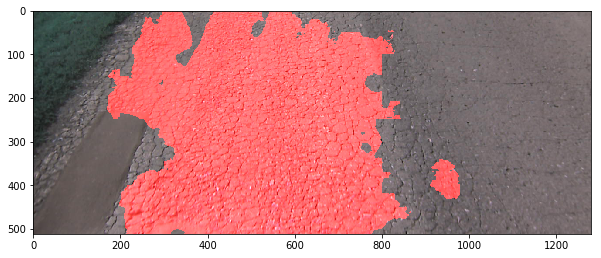

# Description
This repo contains a Jupyter Notebook that makes inference of unet model.

# Clone repository
``` 
git clone https://github.com/supervisely/supervisely.git
```

# Preparation with NN weights
Download NN from your account. Then unpack archive to the folder `tutorials/03_slwin_inference/data/model`. Put your projects with images into `data`. For example, `03_slwin_inference` folder will look like this:

```
.
├── data
│   ├── data
│   │   └── main_task
│   │       ├── meta.json
│   │       └── my_imgs
│   │           ├── ann
│   │           │   └── 01618.json
│   │           └── img
│   │               └── 01618.png
│   ├── model
│   │   ├── config.json
│   │   └── model.pt
│   ├── results
│   ├── tmp
│   └── task_settings.json
│   
├── docker
│   ├── Dockerfile
│   └── run.sh
│   	
├── README.md
├── result.png
└── src
    ├── UnetV2Applier.py
    └── 03_slwin_inference.ipynb

```

# How to run
Execute the following commands:

```
cd tutorials/03_slwin_inference/docker
./run.sh
```

to build docker image and run the container. Then, within the container:
``` 
cp unet_src/schemas.json schemas.json
jupyter notebook --allow-root --ip=0.0.0.0
```
Your token will be shown in terminal.
After that, run in browser: 
```
http://localhost:8888/?token=your_token
```

After running `03_slwin_inference`, you get the following results:

