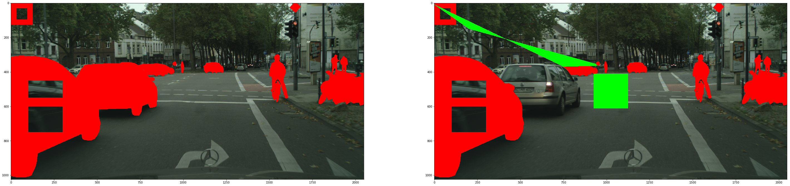

# Description

This repo contains a Jupyter Notebook, which demonstrates how to use custom dtl transformations for images using supervisely lib.

# Clone repository

`git clone https://github.com/supervisely/supervisely.git`

# Preparation with supervisely project

Download project from your account. Then unpack archive to the folder `tutorials/06_dtl_custom_layer/data/project`. Also, you need some empty folders `result`, `tmp` and file `task_settings.json`. For example, `06_dtl_custom_layer` folder will look like this:

```
.
├── data
│   ├── data
│   │   └── project
│   │  		├── Test Project__London
│   │  		└── meta.json
│   ├── result
│   ├── tmp
│   └── task_settings.json
│
├── docker
│   ├── Dockerfile
│   └── run.sh
├── README.md
├── result.png
└── src
    └── 06_dtl_custom_layer.ipynb

```

# How to run

Execute the following commands:

```
cd tutorials/06_dtl_custom_layer/docker
./run.sh
```

to build docker image and run the container. Then, within the container:
``` 
jupyter notebook --allow-root --ip=0.0.0.0
```
Your token will be shown in terminal.
After that, run in browser: 
```
http://localhost:8888/?token=your_token
```

After running `06_dtl_custom_layer.ipynb`, you get the following results: 
