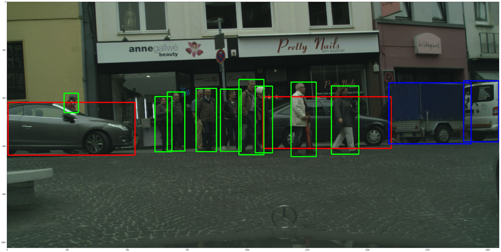

# Description
This repo contains a Jupyter Notebook that makes inference of faster-rcnn model.

# Clone repository
``` 
git clone https://github.com/supervisely/supervisely.git
```

# Preparation with NN weights
Download NN from your account. Then unpack archive to the folder `tutorials/07_faster-rcnn_inference/data/model`. For example, `07_faster-rcnn_inference` folder will look like this:

```
.
├── data
│   ├── img
│   │   └── 00000220.png
│   └── model
│       ├── config.json
│       └── model.pt
├── docker
│   ├── Dockerfile
│   └── run.sh
├── README.md
├── result.png
└── src
    └── 07_faster-rcnn_inference.ipynb

```

# How to run
Execute the following commands:

```
cd tutorials/07_faster-rcnn_inferencedocker
./run.sh
```

to build docker image and run the container. Then, within the container:
``` 
jupyter notebook --allow-root --ip=0.0.0.0
```
Your token will be shown in terminal.
After that, run in browser: 
```
http://localhost:8888/?token=your_token
```

After running `07_faster-rcnn_inference.ipynb`, you get the following results:


